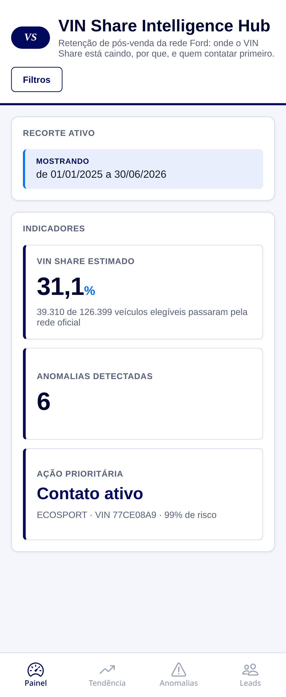
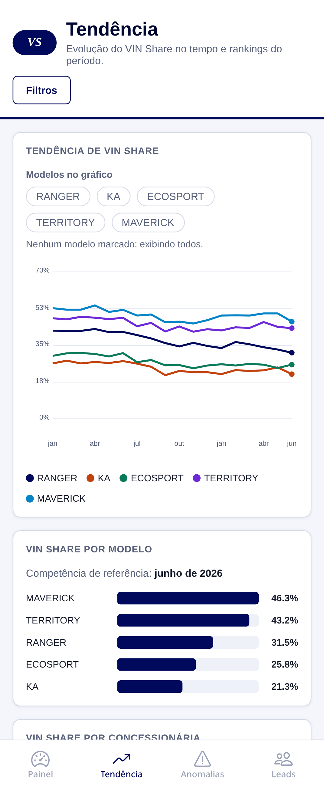
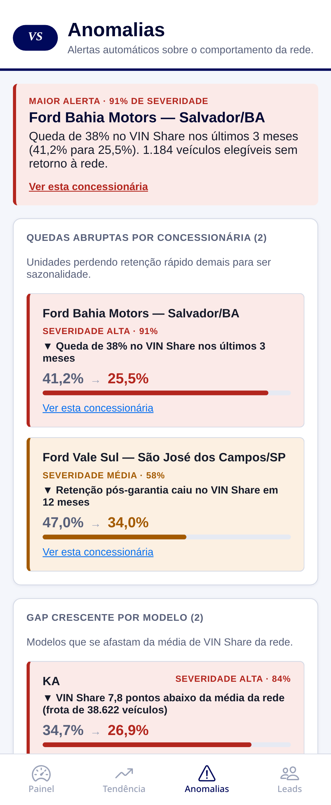
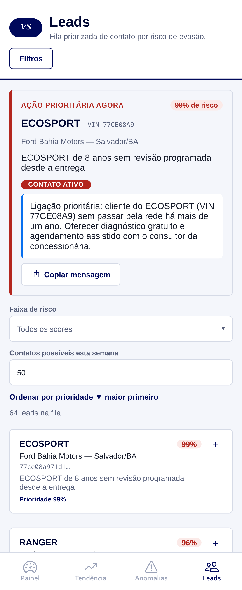
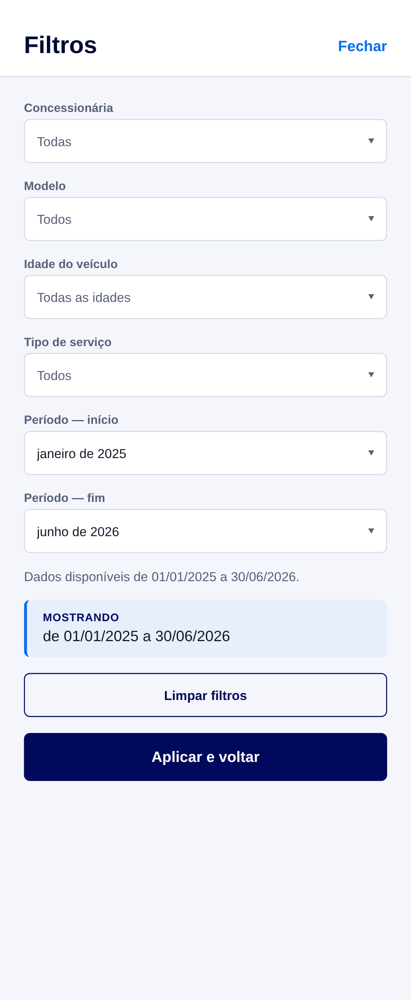

# VIN Share Intelligence Hub — Mobile

Projeto **Ford FideliCar**: aplicativo Android (React Native + Expo) para o
desafio **FIAP × Ford**, reduzindo a evasão silenciosa de clientes da rede
oficial de pós-venda Ford.

## Equipe

| Nome | RM | GitHub |
|---|---|---|
| Albert Katri | RM556544 | [@0ldev](https://github.com/0ldev) |
| Bruno Biletsky | RM554739 | [@Bruno-Biletsky](https://github.com/Bruno-Biletsky) |
| Paulo Akira | RM556840 | [@pauloakira05](https://github.com/pauloakira05) |
| Guilherme Gomes | RM554606 | [@guig3003](https://github.com/guig3003) |

É o port mobile do dashboard web
[`ford-next`](https://github.com/0ldev/ford-next), cobrindo os três pilares do
desafio num único fluxo:

1. **Análise e visualização** — VIN Share por concessionária, modelo, idade
   do veículo e tipo de serviço, tendência no tempo e painel de anomalias.
2. **Geração de leads e modelagem preditiva** — score de risco de evasão por
   veículo e fila de leads priorizada.
3. **Otimização da jornada do cliente** — motor de regras que transforma o
   score numa ação concreta (lembrete, oferta ou contato ativo) com mensagem
   já pronta para copiar e enviar.

O app funciona **100% offline**: os dados vêm de um gerador determinístico
(calibrado com os números reais do desafio — 602.788 ordens de serviço,
175.554 veículos, 435 concessionárias, 20 modelos), então todos os fluxos
funcionam sem depender de backend, API ou conexão no momento da demonstração.

## Telas

| Painel | Tendência |
|---|---|
|  |  |

| Anomalias | Leads |
|---|---|
|  |  |

| Lead expandido | Filtros |
|---|---|
|  |  |

- **Painel** — indicadores principais (VIN Share estimado, anomalias
  detectadas, ação prioritária) e o resumo do recorte de filtros ativo.
- **Tendência** — evolução do VIN Share por modelo ao longo do tempo, ranking
  por modelo e por concessionária na competência mais recente, e distribuição
  do score de risco em toda a base.
- **Anomalias** — três grupos de alerta automático (quedas por
  concessionária, gap por modelo, picos de origem fora da rede), com atalho
  para aplicar o recorte de qualquer anomalia direto nos filtros.
- **Leads** — fila de contato priorizada por risco de evasão, com a ação
  recomendada de cada veículo (mensagem pronta + botão de copiar) e a ação
  prioritária do recorte em destaque no topo.
- **Filtros** — concessionária, modelo, idade do veículo, tipo de serviço e
  período; compartilhados entre todas as telas.

## Stack

- [Expo](https://expo.dev) + [Expo Router](https://docs.expo.dev/router/introduction/) (React Native, TypeScript)
- `react-native-svg` para o gráfico de tendência
- `expo-clipboard` para o botão de copiar mensagem
- Sem backend: dados gerados localmente em `src/infrastructure/mockData.ts`

## Arquitetura

Clean Architecture, mesma separação de camadas do dashboard web original:

```
src/
├── domain/           # regras de negócio puras (severidade, prioridade de lead, competência)
├── application/      # hooks de dados (um por recurso) + contexto de filtros compartilhado
├── infrastructure/    # gerador de dados mockados + fonte de dados
└── presentation/      # tema, componentes e telas React Native

app/                  # rotas do Expo Router (abas + modal de filtros)
```

## Como rodar

```bash
npm install
npx expo start
```

Abre o menu do Expo: `a` para Android (emulador ou dispositivo com Expo Go),
`w` para rodar no navegador.

## Como gerar o APK

Requer uma conta Expo (gratuita) autenticada via `eas login`.

```bash
npx eas-cli login
npx eas-cli build --platform android --profile preview
```

O perfil `preview` (ver `eas.json`) gera um `.apk` pronto para instalar direto
num aparelho ou emulador Android — o perfil padrão do EAS gera `.aab`, que não
instala sem passar pela Play Store.

## Limitações conhecidas

- **Dados simulados, não o dataset real da Ford.** O gerador em
  `mockData.ts` é determinístico e calibrado para refletir a forma dos dados
  reais (mesma concentração de modelos, mesma distribuição de score
  bimodal), mas os valores exibidos são fictícios.
- **Período simplificado para granularidade de mês** no seletor de filtros
  (o dashboard web original aceita datas completas).
- **Sem nome de concessionária no dataset real** — o app mostra nomes
  fictícios para as 5 concessionárias de exemplo; o restante apareceria pelo
  código (`DealerCode`), igual ao comportamento do dashboard original.
